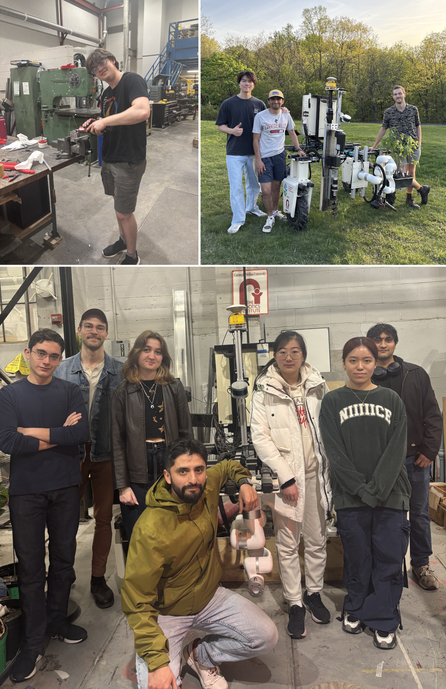

# Johnny

**Johnny** is your reforestation companion. It runs **Johnny OS**, a ROS2 workspace with custom nodes for planning, perception, and more.

<iframe width="560" height="315" src="https://www.youtube-nocookie.com/embed/_pqgol32Glg?si=_x0hIPmL7mIDf02H" title="YouTube video player" frameborder="0" allow="accelerometer; autoplay; clipboard-write; encrypted-media; gyroscope; picture-in-picture; web-share" referrerpolicy="strict-origin-when-cross-origin" allowfullscreen></iframe>

<iframe src="https://andrew1905.autodesk360.com/shares/public/SH30dd5QT870c25f12fc01a381f3c6b7cd86?mode=embed" width="600" height="600" allowfullscreen="true" webkitallowfullscreen="true" mozallowfullscreen="true"  frameborder="0"></iframe>

## About the team
Appleseed Labs is a student team at Carnegie Mellon that built a reforestation robot for the 2025 Farm Robotics Challenge. Our system was awarded the Excellence in Regenerative Agriculture prize.

